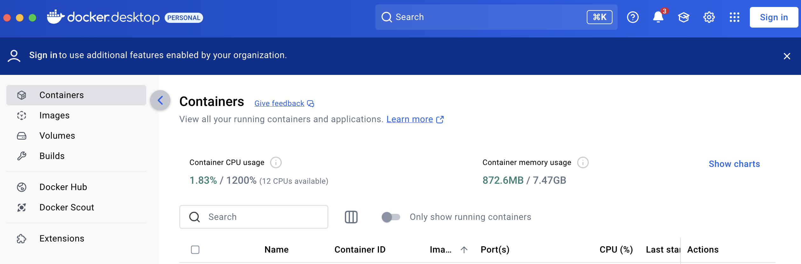

# Lesson

## Brief

### Preparation and Lesson Overview

Ensure you have conda setup. Please do:

```
conda env update -f environment.yml
```

This should install the `kafka` conda environment. You can activate it via:

```
conda activate kafka
```

Lastly, one more step to install the packages:

```
pip install -r requirements.txt
```

Also, we need to host kafka locally via docker.

The learner is first requested to install docker via this link before running the below commands: 
- Windows users: https://docs.docker.com/desktop/setup/install/windows-install/
- Mac users: https://docs.docker.com/desktop/setup/install/mac-install/

> 💡 **Note:**  Installation of docker desktop on Windows works on Windows and also on wsl ubuntu.

After installation, please start docker desktop by searching for `docker` in Windows/Mac, and double-clicking on the application. After docker desktop has started, you will be able to see this:



When you run the below `docker run` command, the kafka image will first be downloaded onto your machine, if it is not already there. 

> 💡 **Note:** You may encounter a message `Unable to find image ... locally`. This is **expected** because the image has to be first downloaded from docker hub.

In the below command, "run" creates and run a docker container. "apache/kafka:latest" tells docker which image to load into container, pulled from the docker hub (https://hub.docker.com/r/apache/kafka).

```
docker run -d --name broker -p 9092:9092 apache/kafka:latest 
```

Next access the Kafka CLI inside the container:

```
docker exec --workdir /opt/kafka/bin/ -it broker sh
```

Create the topic `pizza-orders` using the below:

```
./kafka-topics.sh --bootstrap-server localhost:9092 --create --topic pizza-orders
```

To stop the container at the end of this exercise:

```
docker stop broker
```

To start a container that has been stopped:

```
docker start broker
```

To list all containers (both running and stopped):

```
docker ps -a
```

Full removal at the end: 

```
docker rm -f broker
```

To remove the docker image from your machine (save storage space):

```
docker rmi apache/kafka
```

### Extra

Some kafka commands are provided below which you may find useful:

To list Kafka topics:

```
./kafka-topics.sh --list --bootstrap-server localhost:9092
```

To view the messages inside a Kafka topic:

```
./kafka-console-consumer.sh --bootstrap-server localhost:9092 --topic pizza-orders --from-beginning
```

To delete a Kafka topic:

```
./kafka-topics.sh --delete --topic pizza-orders --bootstrap-server localhost:9092
```

To exit from the Kafka CLI:
```
exit
```

---

## Part 1 - Event Streaming and Stream Processing

Conceptual knowledge, refer to slides.

---

## Part 2 - Hands-on with Kafka

We will be using the notebooks
* notebook/5m_data_2_10_01_Fake_Data_Kafka_Producer.ipynb
* notebook/5m_data_2_10_02_Hands_on_with_Kafka.ipynb

for this section.

Alternative [Colab notebook](https://colab.research.google.com/drive/1WwwGa-tVIqr2aNLPrxqFqFyQAwrxU1JD?usp=sharing) for this section, but note the credentials are no longer valid.

If you are using the Colab notebook:
> Open the Colab link, then go to File -> Save a copy in Drive. This will create a copy of the notebook in your Google Drive. It will then open the notebook in a new tab.
>
> Follow on with the lesson in the notebook.

## Part 3 - Hands-on with Spark (Structured Streaming)

We will be using the notebook
* notebook/5m_data_2_10_03_Hands_on_with_Spark_(Structured_Streaming).ipynb

for this section.

Alternative [Colab notebook](https://colab.research.google.com/drive/1xSEbQmCNqW0HdyD8Z4jwKqCffTb28W7q?usp=sharing) for this section, but note the credentials are no longer valid.

If you are using the Colab notebook:
> Open the Colab link, then go to File -> Save a copy in Drive. This will create a copy of the notebook in your Google Drive. It will then open the notebook in a new tab.
>
> Follow on with the lesson in the notebook.
